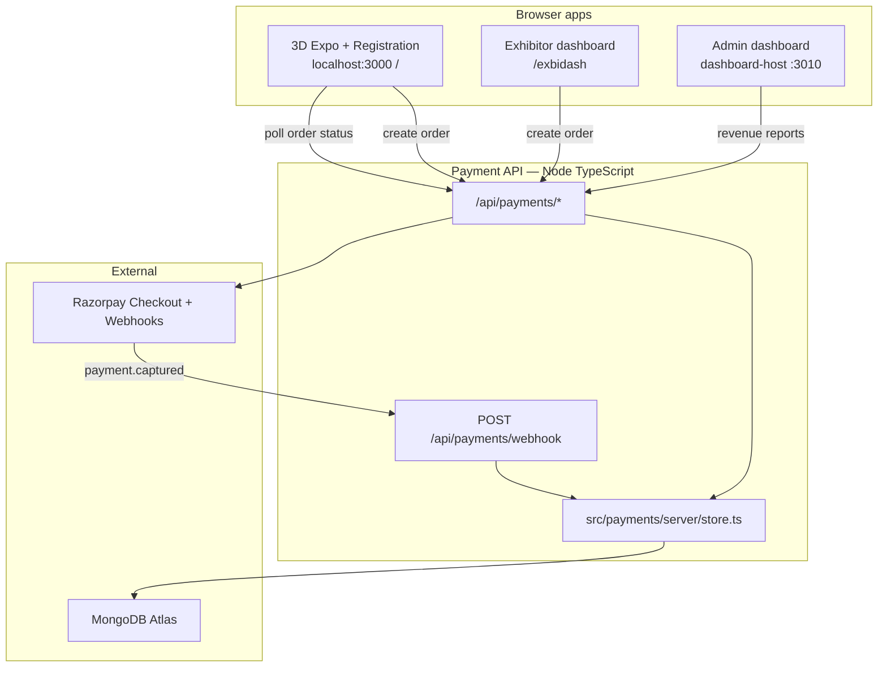
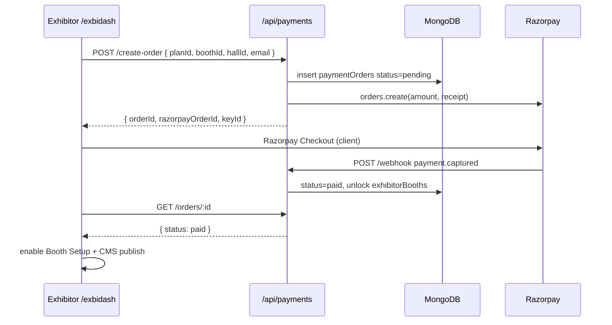
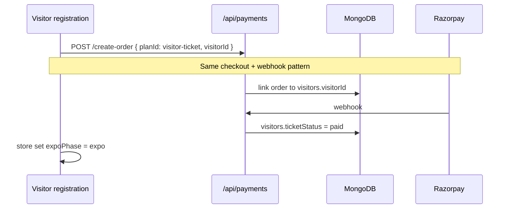

# Payment System Architecture — Virtual Residential Expo

Design for booth fees, visitor tickets, and optional property token payments. Mirrors the existing **`src/dashboard`** split: shared TypeScript layer + Vite plugin (dev) + optional Express mount (prod).

---

## Goals

| Goal | Detail |
|------|--------|
| **Who pays** | Exhibitor (booth/hall), visitor (expo ticket), buyer (optional EOI/token at booth) |
| **Gateway** | Razorpay (India-first); Stripe optional for global |
| **Database** | Same **MongoDB Atlas** cluster as visitors / analytics |
| **Backend language** | **TypeScript + Node.js** (same repo as `/api/visitors`, `/api/analytics`) |
| **Hosting** | **Phase 1:** same Node server as main expo · **Phase 2:** optional `pay.*` microservice |

---

## High-level diagram



---

## Deployment options

### Option A — Same host (recommended for MVP)

```text
https://expo.digitalbroker.in
├── dist/                    React 3D expo
├── /api/visitors/*          existing
├── /api/analytics/*         existing (or proxied)
├── /api/booth-cms/*         existing
└── /api/payments/*          NEW
    └── webhook URL: https://expo.digitalbroker.in/api/payments/webhook
```

**Deploy:** `npm run build && npm run start:prod` (see `DEPLOY_HOSTINGER.md`).

### Option B — Separate payment host (later)

```text
https://expo.digitalbroker.in     → expo + visitors + CMS
https://pay.digitalbroker.in      → /api/payments/* + webhook only
https://dash.digitalbroker.in     → analytics (already separate)
```

**Shared:** same `MONGODB_URI`, CORS on pay API for expo origin, internal API key for server-to-server if needed.

**When to split:** compliance boundary, Go/Rust rewrite, or multi-product reuse.

---

## Code layout (mirror `src/dashboard/`)

```text
src/payments/
├── types.ts                 Order, Plan, PaymentStatus, webhook payloads
├── index.ts                 Public exports
├── api/
│   └── client.ts            fetchCreateOrder, fetchOrderStatus (browser)
└── server/
    ├── store.ts             MongoDB CRUD + indexes
    ├── routes.ts            HTTP handlers (create, status, webhook)
    ├── razorpay.ts          Gateway adapter (create order, verify signature)
    └── express-mount.ts     Optional: mount on dashboard Express app

vite-plugin-payments-api.ts    Dev/preview middleware (like visitors plugin)
```

**Wire in dev:** add plugin to `vite.config.ts` next to `visitorsApiPlugin`.

**Wire in prod:** either same Vite preview middleware stack **or** mount `express-mount.ts` on `dashboard-host/server.mts` if payment runs on dash VPS.

---

## Payment flows

### Flow 1 — Exhibitor booth fee (primary)



**UI entry:** `src/features/exhibitorDashboard/` — new **Billing** nav item or gate before Setup.

**Gate:** `exhibitorBooths.paidUntil` or `paymentOrders.status === 'paid'` for `boothId`.

### Flow 2 — Visitor expo ticket



**UI entry:** `src/features/registration/` — after onboarding, before main hall.

**Gate:** `src/store/index.ts` — block `expoPhase` until `ticketStatus === 'paid'` (or admin bypass).

### Flow 3 — Property token / EOI (optional, phase 3)

**UI entry:** `src/features/media/CtaResourcePopup.tsx` or questionnaire completion.

**Metadata on order:** `boothId`, `visitorId`, `unitId`, `purpose: 'eoi'`.

---

## MongoDB collections

All in the **same database** as `visitors`, `expoAnalyticsEvents`.

### `paymentPlans`

Catalog of what can be purchased.

```ts
{
  planId: 'exhibitor-booth-standard',   // unique
  kind: 'exhibitor' | 'visitor' | 'eoi',
  label: 'Standard Booth — Hall 1',
  amountPaise: 5000000,                 // ₹50,000
  currency: 'INR',
  hallId?: 'hall-1',
  boothTier?: 'standard' | 'premium',
  active: true,
  sortOrder: 1,
  createdAt: Date,
  updatedAt: Date,
}
```

**Index:** `{ planId: 1 }` unique.

### `paymentOrders`

One document per checkout attempt.

```ts
{
  orderId: 'ord_…',                    // our id (unique)
  planId: 'exhibitor-booth-standard',
  kind: 'exhibitor' | 'visitor' | 'eoi',
  amountPaise: 5000000,
  currency: 'INR',
  status: 'pending' | 'paid' | 'failed' | 'expired' | 'refunded',

  // Who
  visitorId?: 'VX-…',
  exhibitorEmail?: 'sales@builder.com',
  boothId?: 'vertex-elite',
  hallId?: 'hall-1',

  // Gateway
  gateway: 'razorpay',
  razorpayOrderId?: string,
  razorpayPaymentId?: string,
  razorpaySignature?: string,

  // Idempotency
  idempotencyKey?: string,             // client or server generated
  webhookEventIds: string[],           // processed Razorpay event ids

  metadata?: Record<string, string>,
  paidAt?: Date,
  createdAt: Date,
  updatedAt: Date,
}
```

**Indexes:**

- `{ orderId: 1 }` unique  
- `{ razorpayOrderId: 1 }` sparse unique  
- `{ visitorId: 1, status: 1 }`  
- `{ boothId: 1, hallId: 1, status: 1 }`  
- `{ createdAt: -1 }`

### `paymentWebhookEvents` (audit)

Raw webhook body + processing result — debug and dispute handling.

```ts
{
  eventId: string,           // Razorpay event id (unique)
  type: string,
  orderId?: string,
  payload: object,
  processedAt: Date,
  ok: boolean,
  error?: string,
}
```

**Index:** `{ eventId: 1 }` unique.

### `exhibitorEntitlements` (optional denormalized unlock)

Fast gate checks without aggregating orders every request.

```ts
{
  exhibitorEmail: string,
  boothId: string,
  hallId: string,
  paidUntil: Date | null,    // null = lifetime for this expo
  lastOrderId: string,
  updatedAt: Date,
}
```

**Index:** `{ exhibitorEmail: 1, boothId: 1, hallId: 1 }` unique.

---

## API contract

| Method | Path | Auth | Purpose |
|--------|------|------|---------|
| `GET` | `/api/payments/plans?kind=exhibitor&hallId=hall-1` | public | List active plans |
| `POST` | `/api/payments/create-order` | session / email | Create pending order + Razorpay order |
| `GET` | `/api/payments/orders/:orderId` | owner | Poll status after checkout |
| `POST` | `/api/payments/verify` | client | Optional: verify signature after redirect (backup to webhook) |
| `POST` | `/api/payments/webhook` | Razorpay HMAC | **Source of truth** for `paid` |
| `GET` | `/api/payments/admin/summary` | admin key | Revenue KPIs for dashboard-host |

### `POST /api/payments/create-order` body

```json
{
  "planId": "exhibitor-booth-standard",
  "visitorId": "VX-ABC123",
  "exhibitorEmail": "sales@builder.com",
  "boothId": "vertex-elite",
  "hallId": "hall-1",
  "idempotencyKey": "optional-client-uuid"
}
```

### Response

```json
{
  "ok": true,
  "orderId": "ord_01…",
  "amountPaise": 5000000,
  "currency": "INR",
  "razorpayOrderId": "order_…",
  "razorpayKeyId": "rzp_test_…"
}
```

Browser opens Razorpay Checkout with `order_id`, `key`, `amount`, `currency`.

---

## Security rules

1. **Secrets server-only:** `RAZORPAY_KEY_SECRET`, `RAZORPAY_WEBHOOK_SECRET` — never `VITE_*`.
2. **Webhook verification:** validate `X-Razorpay-Signature` on every webhook; reject if invalid.
3. **Idempotent webhooks:** if `eventId` already in `paymentWebhookEvents`, return 200 without double-unlock.
4. **Amount integrity:** never trust client amount — always read `amountPaise` from `paymentPlans` by `planId`.
5. **Mark paid only after:** webhook `payment.captured` **or** server-side `orders.fetch` + signature verify.
6. **HTTPS only** in production for webhook URL.
7. **No card data** in MongoDB — Razorpay PCI scope.

---

## Environment variables

```bash
# Required for payments
MONGODB_URI=mongodb+srv://…
RAZORPAY_KEY_ID=rzp_live_…
RAZORPAY_KEY_SECRET=…
RAZORPAY_WEBHOOK_SECRET=…

# Optional
PAYMENTS_CORS_ORIGINS=https://expo.digitalbroker.in
PAYMENTS_ADMIN_KEY=…          # admin revenue API
PAYMENT_DEFAULT_CURRENCY=INR
```

Public key for Checkout can be returned from `create-order` response (not baked into `VITE_` unless you accept key rotation via rebuild).

---

## Integration map (existing codebase)

| Existing module | Payment touchpoint |
|-----------------|-------------------|
| `src/features/registration/` | Visitor ticket checkout before `expoPhase → 'expo'` |
| `src/features/exhibitorDashboard/` | Booth billing page; gate Setup / Uploads |
| `src/store/index.ts` | `ticketStatus`, `boothEntitlement` flags |
| `src/server/mongodb.ts` | Reuse `getDb()` pattern; or payments store owns collections |
| `vite.config.ts` | Register `paymentsApiPlugin` |
| `dashboard-host/` | Admin **Payments** page: orders, revenue, failed webhooks |
| `src/dashboard/hooks/useVisitorTracking.ts` | Optional event: `payment_completed` |

---

## Phased rollout

| Phase | Scope | Exit criteria |
|-------|--------|---------------|
| **P0 — Design** | This doc + `src/payments/types.ts` | Types and API contract agreed |
| **P1 — Exhibitor MVP** | One plan, create-order, webhook, unlock one booth | Paid exhibitor can open `/exbidash` Setup |
| **P2 — Visitor ticket** | Registration gate + visitor plan | Unpaid visitor cannot enter main hall |
| **P3 — Admin** | dashboard-host revenue table | Ops sees orders + MRR |
| **P4 — EOI / token** | Booth CTA checkout | Buyer pays token from booth popup |
| **P5 — Split host** | Move API to `pay.*` if needed | Same MongoDB, new deploy unit |

---

## Why not Rust / Go (for this repo)

Payment I/O is **HTTP + MongoDB + Razorpay** — not CPU-bound. Your app is already **Node + TypeScript** end-to-end. A separate Go/Rust service is valid at scale but adds a second deploy and duplicate models. Start in **`src/payments/`**; extract to `pay.digitalbroker.in` later without changing the data model.

---

## Related docs

- `ARCHITECTURE.md` — feature modules and routes  
- `DEPLOY_HOSTINGER.md` — Node vs static hosting (payments **require Node**)  
- `DASHBOARD_SETUP_COMPLETE.md` — analytics split pattern to copy  
- `src/payments/types.ts` — TypeScript contracts for implementation  

---

## Implementation checklist

- [ ] Add `src/payments/server/store.ts` — indexes + CRUD  
- [ ] Add `src/payments/server/razorpay.ts` — adapter  
- [ ] Add `src/payments/server/routes.ts` — handlers  
- [ ] Add `vite-plugin-payments-api.ts` — dev middleware  
- [ ] Register plugin in `vite.config.ts`  
- [ ] Seed `paymentPlans` in MongoDB  
- [ ] Exhibitor Billing UI + entitlement gate  
- [ ] Razorpay dashboard: webhook URL + live keys  
- [ ] Admin summary route on dashboard-host (optional P3)  
